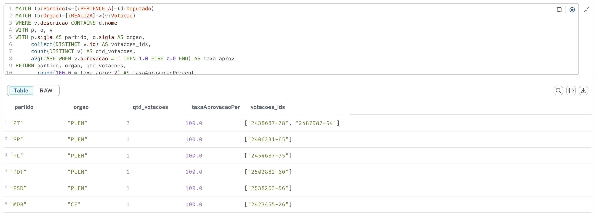
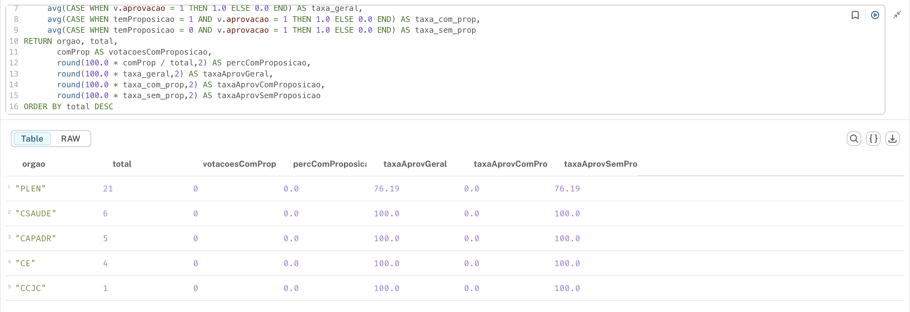
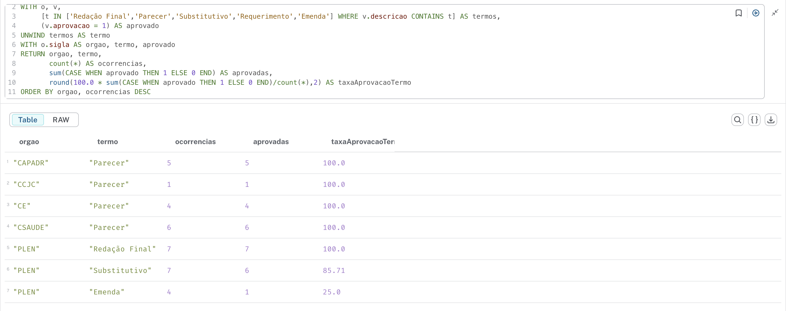
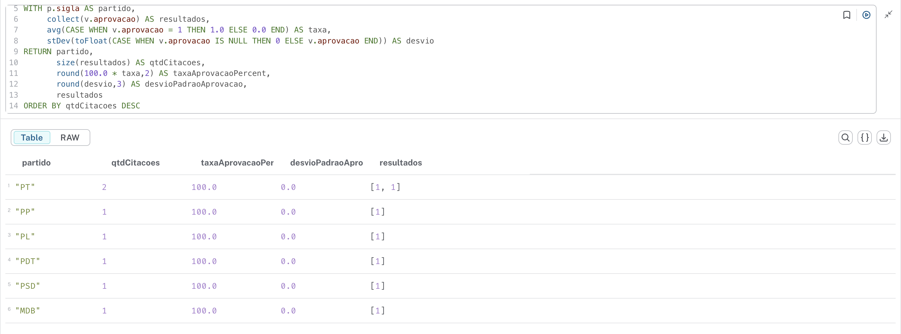
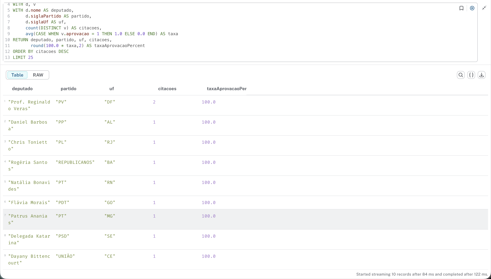

## 1) Os deputados de um mesmo estado (UF) tendem a ser do mesmo partido?

**Cypher (exemplo):**

```cypher
MATCH (d:Deputado)
RETURN d.siglaUf AS uf, collect(d.siglaPartido) AS partidos, count(*) AS deputados
```

**Resultado (entropia por UF):**



**Análise (resumo):**

- Calculada entropia de Shannon da distribuição de partidos por UF. Valores menores indicam que um estado é mais homogêneo (poucos partidos concentrando representantes). Veja a tabela `q1_df` para os números.


## 2) Quais estados têm maior diversidade partidária?

**Cypher (exemplo):**

```cypher
MATCH (d:Deputado)
RETURN d.siglaUf AS uf, count(*) AS deputados, count(DISTINCT d.siglaPartido) AS num_partidos
ORDER BY num_partidos DESC
```



- Estados com maior número de partidos por deputado aparecem no scatter plot. Verifique `q2_df` para detalhes.


## 3) Quais partidos têm representação em mais estados?

**Cypher (exemplo):**

```cypher
MATCH (p:Partido)<-[:REL]-(d:Deputado)
RETURN p.sigla AS partido, count(DISTINCT d.siglaUf) AS num_estados, count(d) AS membros
ORDER BY num_estados DESC
```



- Aqui são listados os partidos que são realmente nacionais (presentes em mais UFs) vs os regionais.


## 4) Quais combinações partido-UF têm mais deputados? Quem são esses deputados?

**Cypher (exemplo):**

```cypher
MATCH (d:Deputado)
RETURN d.siglaUf AS uf, d.siglaPartido AS partido, collect(d.nome) AS membros, count(*) AS total
ORDER BY total DESC
LIMIT 10
```



- Top grupos (UF+Partido) e membros associados estão listados no documento; visualizaçao do grupo com mais deputados incluída.


## 5) Quão semelhantes são os partidos em termos de presença geográfica (Jaccard sobre UFs)?

**Cypher (exemplo, usa APOC):**

```cypher
MATCH (d:Deputado)
WITH d.siglaPartido AS partido, collect(DISTINCT d.siglaUf) AS ufs
UNWIND apoc.coll.pairsMin(collect({p:partido, ufs:ufs})) AS pair
RETURN pair[0].p AS p1, pair[1].p AS p2,
       apoc.coll.intersection(pair[0].ufs, pair[1].ufs) AS inter,
       apoc.coll.union(pair[0].ufs, pair[1].ufs) AS uni,
       size(apoc.coll.intersection(pair[0].ufs, pair[1].ufs))*1.0 / size(apoc.coll.union(pair[0].ufs, pair[1].ufs)) AS jaccard
ORDER BY jaccard DESC
LIMIT 20
```



- Tabela com as 20 maiores similaridades Jaccard entre partidos. Heatmap mostra similaridade entre os maiores partidos.

