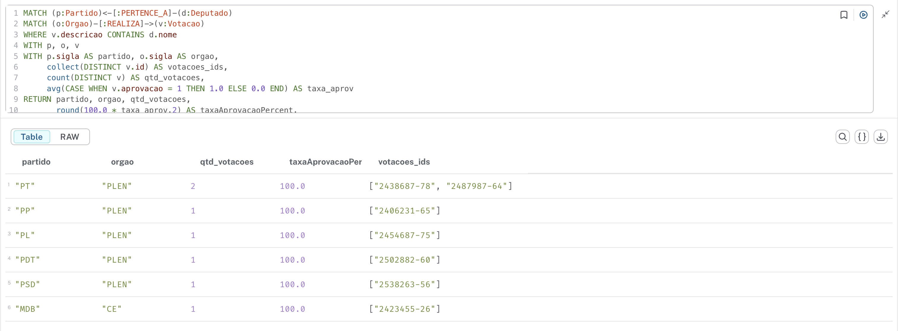
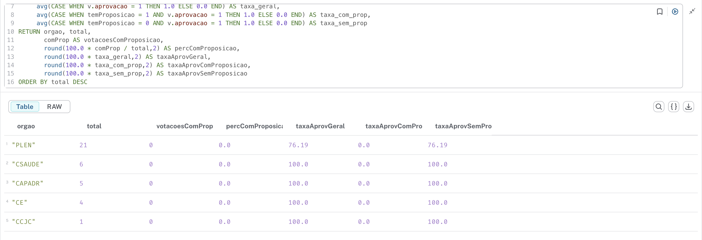

### 1. Partidos com maior presença como relatores/atores em votações e relação com taxa de aprovação

**(a) Pergunta**: Quais partidos aparecem mais frequentemente citados nas descrições de votações (indicando atuação de seus Deputados como relatores, autores de requerimentos ou emendas) e essa presença está associada a maior taxa de aprovação (campo `aprovacao`)?

**(b) Consulta Cypher**:

```cypher
MATCH (p:Partido)<-[:PERTENCE_A]-(d:Deputado)
MATCH (o:Orgao)-[:REALIZA]->(v:Votacao)
WHERE v.descricao CONTAINS d.nome
WITH p, o, v
WITH p.sigla AS partido, o.sigla AS orgao,
     collect(DISTINCT v.id) AS votacoes_ids,
     count(DISTINCT v) AS qtd_votacoes,
     avg(CASE WHEN v.aprovacao = 1 THEN 1.0 ELSE 0.0 END) AS taxa_aprov
RETURN partido, orgao, qtd_votacoes,
       round(100.0 * taxa_aprov,2) AS taxaAprovacaoPercent,
       votacoes_ids
ORDER BY qtd_votacoes DESC, taxaAprovacaoPercent DESC
```

**(c) Print**: 

**(d) Análise**: Esta consulta aproxima a “visibilidade” de um partido nas votações via menções diretas a nomes de Deputados em descrições oficiais (frequentemente indicando relatoria ou protagonismo). Partidos com alto número de menções em conjunto com elevada taxa de aprovação sugerem capacidade de pautar e conduzir matérias a resultados positivos, refletindo coordenação interna ou posicionamento estratégico em comissões e plenário. Já partidos muito citados com baixa taxa de aprovação podem estar assumindo temas controversos, atuando em obstrução ou em fases intermediárias (ex.: emendas rejeitadas). O insight auxilia na identificação de quais siglas convertem presença em efetividade decisória.

---

### 2. Órgãos (comissões vs plenário) e impacto da existência de proposição explicitamente vinculada na aprovação

**(a) Pergunta**: Votações associadas explicitamente a uma Proposição (`(:Proposicao)-[:REFERENCIADA_EM]->(v)`) têm maior taxa de aprovação em cada órgão do que votações sem essa referência? Quais órgãos apresentam maior dependência de proposições formais para aprovação?

**(b) Consulta Cypher**:

```cypher
MATCH (o:Orgao)-[:REALIZA]->(v:Votacao)
OPTIONAL MATCH (p:Proposicao)-[:REFERENCIADA_EM]->(v)
WITH o, v, CASE WHEN p IS NULL THEN 0 ELSE 1 END AS temProposicao
WITH o.sigla AS orgao,
     count(v) AS total,
     sum(temProposicao) AS comProp,
     avg(CASE WHEN v.aprovacao = 1 THEN 1.0 ELSE 0.0 END) AS taxa_geral,
     avg(CASE WHEN temProposicao = 1 AND v.aprovacao = 1 THEN 1.0 ELSE 0.0 END) AS taxa_com_prop,
     avg(CASE WHEN temProposicao = 0 AND v.aprovacao = 1 THEN 1.0 ELSE 0.0 END) AS taxa_sem_prop
RETURN orgao, total,
       comProp AS votacoesComProposicao,
       round(100.0 * comProp / total,2) AS percComProposicao,
       round(100.0 * taxa_geral,2) AS taxaAprovGeral,
       round(100.0 * taxa_com_prop,2) AS taxaAprovComProposicao,
       round(100.0 * taxa_sem_prop,2) AS taxaAprovSemProposicao
ORDER BY total DESC
```

**(c) Print**: 

**(d) Análise**: A diferença entre taxa de aprovação com e sem proposição vinculada revela o papel do rito formal na previsibilidade do resultado. Órgãos em que a aprovação depende fortemente da presença de uma proposição podem funcionar como estágios de consolidação técnica/ jurídica antes de avançar para debates mais abertos. Um gap grande (taxa_com_prop >> taxa_sem_prop) sugere que votações “avulsas” (ex.: requerimentos administrativos) são mais sujeitas a rejeição ou controvérsia. Se o plenário exibir menor diferença, indica que a dinâmica política final é menos sensível à formalização anterior, enquanto comissões especializadas podem filtrar e amadurecer proposições garantindo aprovação quase certa quando elas são formalmente referenciadas.

---

### 3. Termos-chaves em descrições de votações e sua associação a aprovação por órgão

**(a) Pergunta**: Certos termos ("Redação Final", "Parecer", "Substitutivo", "Requerimento", "Emenda") nas descrições estão ligados a taxas de aprovação distintas e isso varia entre órgãos? Quais palavras sinalizam maior probabilidade de êxito?

**(b) Consulta Cypher**:

```cypher
MATCH (o:Orgao)-[:REALIZA]->(v:Votacao)
WITH o, v,
     [t IN ['Redação Final','Parecer','Substitutivo','Requerimento','Emenda'] WHERE v.descricao CONTAINS t] AS termos,
     (v.aprovacao = 1) AS aprovado
UNWIND termos AS termo
WITH o.sigla AS orgao, termo, aprovado
RETURN orgao, termo,
       count(*) AS ocorrencias,
       sum(CASE WHEN aprovado THEN 1 ELSE 0 END) AS aprovadas,
       round(100.0 * sum(CASE WHEN aprovado THEN 1 ELSE 0 END)/count(*),2) AS taxaAprovacaoTermo
ORDER BY orgao, ocorrencias DESC
```

**(c) Print**: 

**(d) Análise**: Palavras como “Redação Final” e “Parecer” tendem a representar fases conclusivas do processo legislativo, frequentemente após negociações e ajustes; altas taxas de aprovação nesses casos refletem maturidade e consenso já construído. “Emenda” ou “Substitutivo” podem carregar maior volatilidade: rejeições de emendas indicam disputas sobre mérito ou estratégia. Comparar órgãos mostra onde o texto técnico (Parecer) tem mais peso (ex.: comissões temáticas) e onde expressões processuais (Requerimento) mantêm alta aprovação, possivelmente evidenciando rotinas operacionais. Este insight suporta classificações semânticas de estágio/risco para novas votações.

---

### 4. Variabilidade de resultados quando Deputados de um partido são citados: estabilidade vs volatilidade

**(a) Pergunta**: A atuação textual (menções) de partidos em votações apresenta padrões de estabilidade (resultados quase sempre aprovados) ou alta variância (mistura de aprovações e rejeições)? Quais partidos têm perfil mais previsível nas votações em que seus membros são citados?

**(b) Consulta Cypher**:

```cypher
MATCH (p:Partido)<-[:PERTENCE_A]-(d:Deputado)
MATCH (o:Orgao)-[:REALIZA]->(v:Votacao)
WHERE v.descricao CONTAINS d.nome
WITH p, v
WITH p.sigla AS partido,
     collect(v.aprovacao) AS resultados,
     avg(CASE WHEN v.aprovacao = 1 THEN 1.0 ELSE 0.0 END) AS taxa,
     stDev(toFloat(CASE WHEN v.aprovacao IS NULL THEN 0 ELSE v.aprovacao END)) AS desvio
RETURN partido,
       size(resultados) AS qtdCitacoes,
       round(100.0 * taxa,2) AS taxaAprovacaoPercent,
       round(desvio,3) AS desvioPadraoAprovacao,
       resultados
ORDER BY qtdCitacoes DESC
```

**(c) Print**: 

**(d) Análise**: O desvio-padrão quantifica volatilidade dos resultados em votações onde o partido está textual/semanticamente presente. Partidos com baixa variância e alta taxa de aprovação sugerem foco em matérias de consenso ou eficiência em negociação. Alta variância pode revelar estratégia de presença em pautas polarizadas (aceitando risco), tentativa de moldar agenda ou atuação defensiva (participação em emendas que podem ser rejeitadas). Este indicador pode ser incorporado em scorecard de "risco político" para antecipar necessidade de alinhamento interno em futuras proposições.

---

### 5. Deputados mais citados em descrições de votações e sua taxa de aprovação associada

**(a) Pergunta**: Quais Deputados aparecem com maior frequência nas descrições de votações e essa visibilidade está correlacionada a maior (ou menor) taxa de aprovação nas matérias em que são mencionados?

**(b) Consulta Cypher**:

```cypher
MATCH (d:Deputado)
MATCH (o:Orgao)-[:REALIZA]->(v:Votacao)
WHERE v.descricao CONTAINS d.nome
WITH d, v
WITH d.nome AS deputado,
     d.siglaPartido AS partido,
     d.siglaUf AS uf,
     count(DISTINCT v) AS citacoes,
     avg(CASE WHEN v.aprovacao = 1 THEN 1.0 ELSE 0.0 END) AS taxa
RETURN deputado, partido, uf, citacoes,
       round(100.0 * taxa,2) AS taxaAprovacaoPercent
ORDER BY citacoes DESC
LIMIT 25
```

**(c) Print**: 

**(d) Análise**: Deputados frequentemente citados podem ocupar funções de relatoria, liderança de bancada ou protagonismo em áreas temáticas. Uma alta taxa de aprovação nas votações onde aparecem sugere capacidade de construir acordos e navegar ritos procedimentais; já citações numerosas com taxa reduzida podem refletir exposição em pautas contestadas ou papel de oposicionista. O ranking auxilia na identificação de "influenciadores processuais" e pode orientar seleção de interlocutores estratégicos para apoiar proposições futuras. Limitações atuais (ausência de relações de voto individual) indicam potencial ganho analítico ao enriquecer o grafo com dados de votação nominal.

---
